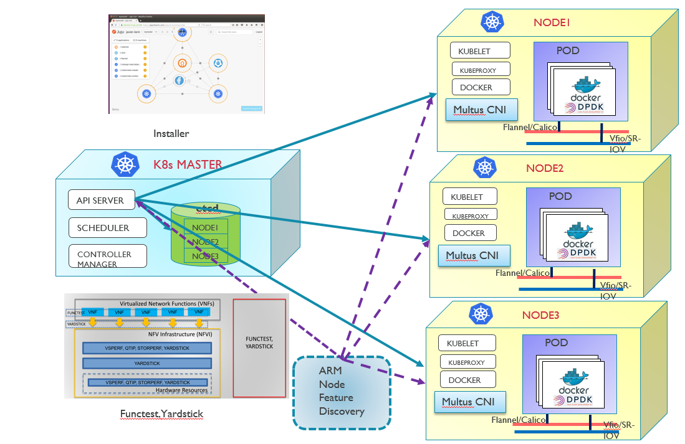
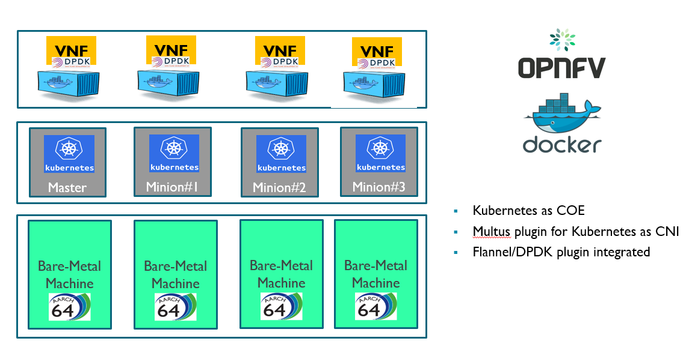
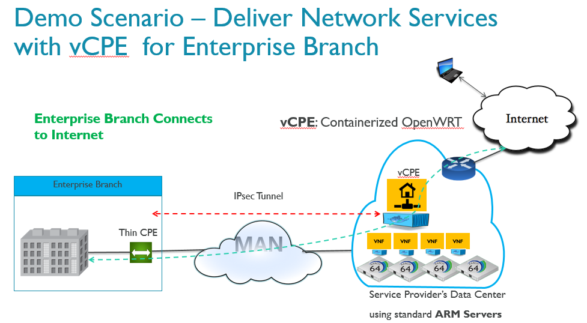
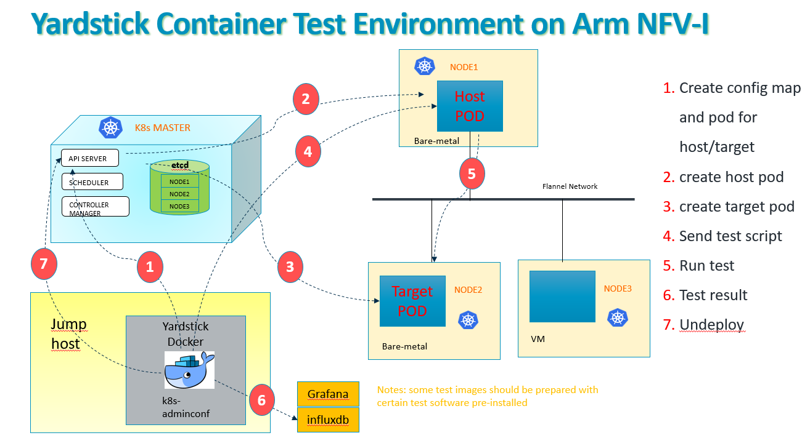

.. This work is licensed under a Creative Commons Attribution 4.0 International
.. License.
.. http://creativecommons.org/licenses/by/4.0
.. (c) OPNFV, Arm Limited.

====================
Container4NFV on Arm
====================

Abstract
========

This document gives a brief introduction on Arm's work status, strategy and possible roadmap for Container4NFV 
on arm64 server platform.
The target of the description is to let you get to know what are Arm's current capability and future 
direction for Container4NFV project. 

Introduction
============

.. _NFV-TST001: http://www.etsi.org/deliver/etsi_gs/NFV-TST/001_099/001/01.01.01_60/gs_NFV-TST001v010101p.pdf
.. _Yardsticktst: https://wiki.opnfv.org/download/attachments/2925202/opnfv_summit_-_bridging_opnfv_and_etsi.pdf?version=1&modificationDate=1458848320000&api=v2

As you know, Arm is a silver member of OPNFV. Arm actively takes part in the work 
of Container4NFV project which aims to enable building a container-based NFV 
infrastructure in edge node or core-network on Arm server platform.
We would introduce the work of Arm containerized NFV-I from the following points:
1. Architecture
2. Container Networking
3. Related Projects
4. Current Status and Future Plan
5. Contacts

Architecture
============

.. _architecture: https://wiki.opnfv.org/pages/viewpage.action?spaceKey=OpenRetriever&title=Container%27s+Architecture+for+Cloud+Native+NFV

Basically, Arm's containerized NFV infrastructure aligns with the architecture_ of Container4NFV which now usually uses
the Kubernetes as the Container Orchestration Engine(COE), and the CNI as the network framework. 
Currently a typical architecture of containerized NFV-I on Arm is composed of installer, Kubernetes, related OPNFV projects, such as
Functest, Yardstick, and possible Arm Node Feature Discovery(A-NFD) which would enable finding certain resources and their usage status
of Arm servers and is still to be developed. In the future, other high-level VNF orchestration engines, such as Tacker or ONAP would also
be brought in to facilitate the deployment of actual VNFs.

A typical VNF networking service deployment is given as the following graph:

Container Networking
====================

Basic Networking Model
----------------------

Since Arm's containerized NFV infrastructure uses Kubernetes as the COE, so the CNI plug-ins are used to orchestrate networking. 
Every time a POD is initialized or removed, the default CNI plug-in is called with the default configuration. This CNI plug-in 
creates a pseudo interface, attaches it to the relevant underlay network, sets the IP and routes and maps it to the POD namespace.

.. _model: https://kubernetes.io/docs/concepts/cluster-administration/networking/
.. _Flannel: https://github.com/coreos/flannel
.. _here: https://github.com/coreos/flannel/releases
.. _Calico: http://docs.projectcalico.org/

The Kubernetes networking model_ satisfies the following fundamental requirements:
* *1* all containers can communicate with all other containers without NAT
* *2* all nodes can communicate with all containers (and vice-versa) without NAT
* *3* the IP that a container sees itself as is the same IP that others see it as

On the Arm platform, the most common Kubernetes networking solution is Flannel_ which uses overlay technique to resolve the pod 
communication across hosts. The arm64 version of Flannel release can be found here_. Project Calico_ is also a high performance,
highly scalable networking solution which provides network policy for connecting Kubernetes pods based on the same IP networking 
principles as the internet. But Calico for Arm is still under development and it's one of our task to enable it for container 
networking on Arm Container4NFV.

.. _guide: https://thenewstack.io/hackers-guide-kubernetes-networking/

Refer to guide_, Kubernetes uses CNI plug-ins to orchestrate networking. Every time a POD is initialized or removed, the default 
CNI plug-in is called with the default configuration. This CNI plug-in creates a pseudo interface, attaches it to the relevant 
underlay network, sets the IP and routes and maps it to the POD namespace.

.. _CNI: https://github.com/containernetworking/cni
.. _release: https://github.com/containernetworking/cni/releases

Most of the ordinary Kubernetes CNI_ plugins for arm64, including bridge, flannel, loopback, host-local, portmap, macvlan, ipvlan, ptp, 
noop could be found in the release_ of containernetworking CNI. Current CNI plugins stable version for arm64 is v0.6.0.

Multiple Interfaces Support in a Pod
------------------------------------

.. _Multus: https://github.com/Intel-Corp/multus-cni
.. _SR-IOV: https://github.com/hustcat/sriov-cni
.. _DPDK: https://github.com/Intel-Corp/sriov-cni
.. _PF: https://github.com/hustcat/sriov-cni/issues/14

Kubernetes initially supports only one CNI interface per POD with one cluster-wide configuration. But some VNFs with data plane 
acceleration, there would be one or two interfaces used for high performance data access besides the normal interfaces, such as 
Flannel, Calico, Weave, PTP, which are still kept for control or configuration purpose. 

The SR-IOV_ CNI or DPDK_ CNI could be chosen to add data plane acceleration interfaces for Kubernetes Pods. Arm is doing some
improvement on SR-IOV_ CNI to assign PF_ directly if VF is not needed or available.

With the help of Multus_ CNI plugin, multiple interfaces can be added at the same time when deploying a pod. The Multus CNI has 
the following features:

- It is a contact between the container runtime and other plugins, and it doesn't have any of its own net configuration, it calls 
other plugins like flannel/calico to do the real net conf job. 

- Multus reuses the concept of invoking the delegates in flannel, it groups the multi plugins into delegates and invoke each 
other in sequential order, according to the JSON scheme in the cni configuration.

- No. of plugins supported is dependent upon the number of delegates in the conf file.

- Master plugin invokes "eth0" interface in the pod, rest of plugins(Mininon plugins eg: sriov,ipam) invoke interfaces as "net0", 
"net1".. "netn"

- The "masterplugin" is the only net conf option of Multus cni, it identifies the primary network. The default route will point 
to the primary network.

A typical Multus CNI configuration with DPDK passthrough enabled is given below:

{
    "name": "multus-k8s-network",
    "type": "multus",
    "delegates": [
        {
                "type": "flannel",
                "masterplugin": true,
                "delegate": {
                        "isDefaultGateway": true
                }
        },
        {
                "type": "sriov",
                "dpdk": {
                        "ethernet_driver": "ixgbe",
                        "io_driver": "vfio-pci",
			"dpdk_devbind": "/root/dpdk/usertools/dpdk-devbind.py"
                }
        },
        {
                "type": "sriov",
                "dpdk": {
                        "ethernet_driver": "ixgbe",
                        "io_driver": "vfio-pci",
			"dpdk_devbind": "/root/dpdk/usertools/dpdk-devbind.py"
                }
        }
    ]
}

Related Projects
================

For aligning with Container4NFV 'E' release requirement, there are 3 related projects on Arm Container4NFV platform, which are 
Installer(Joid or others), Yardstick for performance evaluation and Functest for basic function verification.

Installer
---------

Installer is responsible for the deployment of a typical Container4NFV environment, and for 'E' release, it is considered to have
a Kubernetes cluster, a simple networking solution(Flannel), Yardstick, and some VNFs. The possible installer for arm64 platform 
would be based on one of MCP，JOID，Apex. 

Yardstick
---------

.. _Yardstick: https://wiki.opnfv.org/yardstick
.. _contribution: https://gerrit.opnfv.org/gerrit/#/c/43721/
.. _feature: https://gerrit.opnfv.org/gerrit/#/c/43719/
.. _enabling: https://gerrit.opnfv.org/gerrit/#/c/43723/

Yardstick_ is an OPNFV Project. The project's goal is to verify infrastructure compliance, from the perspective
of a Virtual Network Function(VNF). The latest Yardstick implementation had been enhanced to support Kubernetes context and we have
enabled it on arm64 platform. 

A typical sample arm64 config file corresponding to yardstick/tests/opnfv/test_cases/opnfv_yardstick_tc080.yaml which is for x86 is 
given below:

# Sample benchmark task config file
# measure network latency using ping in container

schema: "yardstick:task:0.1"

scenarios:
-
  type: Ping
  options:
    packetsize: 200

  host: host-k8s
  target: target-k8s

  runner:
    type: Duration
    duration: 60
    interval: 1

  sla:
    max_rtt: 10
    action: monitor

context:
  type: Kubernetes
  name: k8s

  servers:
    host:
      image: openretriever/yardstick_aarch64
      command: /bin/bash
      args: ['-c', 'chmod 700 ~/.ssh; chmod 600 ~/.ssh/*; service ssh restart;while true ; do sleep 10000; done']
    target:
      image: openretriever/yardstick_aarch64
      command: /bin/bash
      args: ['-c', 'chmod 700 ~/.ssh; chmod 600 ~/.ssh/*; service ssh restart;while true ; do sleep 10000; done']

.. _openretriever: https://hub.docker.com/u/openretriever/

Some other useful testing images for arm64, such as images for iperf3, netperf could also be found in the docker hub under openretriever_. 

Besides enabling_ some tests on Arm platform, Arm has made contributions_ to add more support for Kubernetes context 
and enable a special feature_ for the netperf test scenario.

Functest
--------

.. _functest: https://wiki.opnfv.org/display/functest/Opnfv+Functional+Testing
.. _Danube: http://docs.opnfv.org/en/stable-danube/submodules/functest/docs/testing/user/userguide/index.html

The  Functest project provides comprehensive testing methodology, test suites and test cases to test and verify OPNFV Platform functionality 
that covers the VIM and NFVI components.

Functest for Container4NFV could used to verify the basic VIM functionality to support VNF operations(create, modify, shrink, destroy). For 
the Danube_ release,  there are 4 domains(VIM, Controllers, Features, VNF) and 5 tiers(healthcheck, smoke, features, components, vnf) and more 
than 20 test cases.

But now the Functest has not been extended to support Kubernetes, which is still under developing.

Current Status and Future Plan
==============================

Now for Arm containerized NFV-I, we have enabled Multus CNI with Flannel CNI, SR-IOV/DPDK CNI. Data plane acceleration with DPDK on SR-IOV or NIC
passthrough in containers has also been enabled and tested.

.. image: images/Container Networking Acceleration with DPDK.png

A typical VNF(OpenWRT) has been enabled on the arm64 containerized platform to demo a vCPE use case.

We have also enabled Yardstick to verify the compliance of the Pod communication in the Kubernetes context. 

For the future plan, we would continue to align with the development roadmap of Container4NFV. And the following work would be also be preferred
 for Arm Contaier4NFV of the next 'F' release:

* *1* Project Calico enablement for arm64
* *2* VPP DPDK/ODP for container networking
* *3* OPNFV installer enablement on Arm for Container4NFV
* *4* Possible enhancement to Yardstick, Functest
* *5* Typical VNFs w/o data plane accelerations
* *6* CI work with Yardstick, Functest

Contacts
========

Trevor Tao(Zijin Tao), Bin Lu, Song Zhu, Kaly Xin and Yibo Cai from Arm have made contributions to this document.

Trevor Tao:  trevor.tao@arm.com
Bin Lu:   bin.lu@arm.com
Song Zhu: song.zhu@arm.com
Kaly xin:  kaly.xin@arm.com
Yibo Cai:   yibo.cai@arm.com

