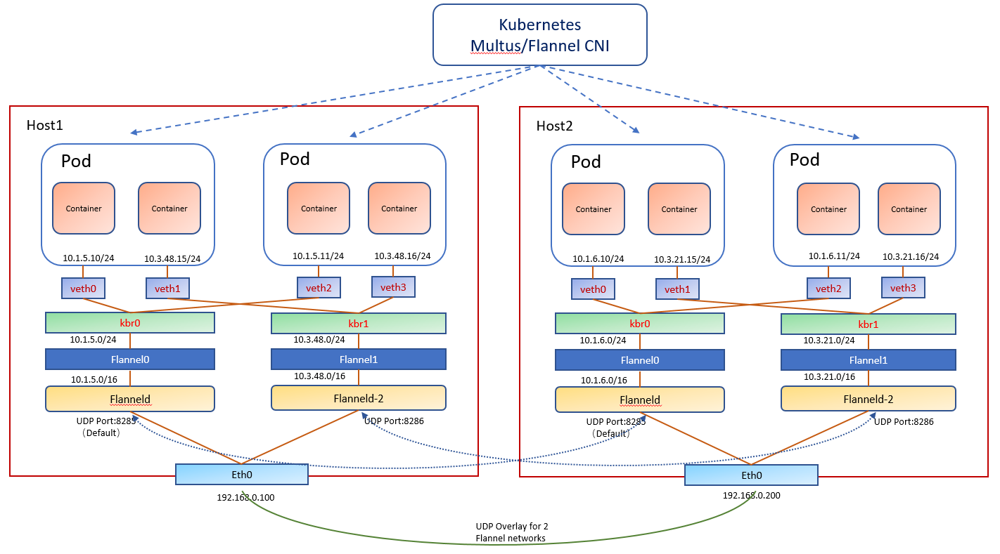

.. This work is licensed under a Creative Commons Attribution 4.0 International
.. License.
.. http://creativecommons.org/licenses/by/4.0
.. (c) OPNFV, Arm Limited.

=======================================================================
Multiple Flannel Interfaces Deployment for Kubernetes Pod on Arm server
=======================================================================

Abstract
========

This document gives a brief introduction on how to deploy multiple Flannel interfaces for Kubernetes
Pod on Arm server.
For simplicity, here the word 'multiple' is for '2' which can be easily extended to more with the methods
introduced in this document.
Besides Arm server, most of the deployment steps talked in the document can be used on other platforms.

Introduction
============

.. _Flannel: https://github.com/coreos/flannel
.. _Multus:  https://github.com/Intel-Corp/multus-cni
.. _Compass: https://wiki.opnfv.org/display/compass4nfv/Compass4nfv
.. _arm64:   https://github.com/kubernetes/website/pull/6511
.. _files:   https://github.com/kubernetes/website/pull/6511/files

As we know, in some cases we need to deploy multiple network interfaces for a single container. For example,
one interface is used for external data access, the other for internal data access. Originally,
only one interface can be deployed for a separate type of Container Networking Interface(CNI). With the help
of Multus_ CNI, multile CNIs can be driven with an integrated configution.

Flannel_ is a widely used solution to configure a layer 3 network fabric designed for Kubernetes. We would
introduce the methods of how to deploy multiple Flannel network interfaces for Kubernetes pod from the
following points:
1. Use Case Architecture
2. Flannel Configuration
3. CNI Configuration
4. Etcd Based Configuration(Optional)
5. Contacts

For project Container4nfv, Arm's favorite installer for Kubernetes clusters is mainly Compass_ now. Arm would try
to give out a typical deployment scenario with Kubernetes networked with 2 flannel interfaces.

Use Case Architecture
=====================

Arm gives out a document on how to deploy Kubernetes on arm64_ platform to the Kubernetes community
which uses Flannel as the networking backend. The related Flannel deployment files_ use Flannel docker
image to start the Flannel service.

:alt: 2 Flannel interfaces deployment scenario
:align: center

   Fig 1. Multiple Flannel interfaces deployment architecture

.. _Etcd: https://coreos.com/etcd/

Figure 1 gives out a typical use case for Kubernetes pod configured with 2 Flannel interfaces.
For this use case, we have to start 2 flanneld processes, each flanneld process listens on a different UDP
port and serves for a different subnet. With the help of Multus_ CNI, the Flannel CNI would be called twice
to attach 2 Linux veth devices to a pod.

Flanneld has 2 ways to get the network backend configuration data: one is from Kubernetes directly by setting
the option "--kube-subnet-mgr", in this way as it simply reads the configuration from the file
"/etc/kube-flannel/net-conf.json"; the other way is from the backend datastore Etcd_ which is the default.

In this document, we would mainly give the Flanneld configuration in the 1st way. Anybody interested
in the 2nd way can refer to the section "Etcd Based Configuration".

Flannel Configuration
=====================

Refer to the Kubernetes installation guide on arm64_, the Flanneld is installed as a Kubernetes DaemonSet in the
kube-flannel.yml. Here we give a revised version of this yaml file to start 2 Flannel containers:

.. include:: files/kube-2flannels.yml
:literal:

   kube-2flannels.yml

ConfigMap Added
---------------

To start the 2nd Flannel container process, we add a new ConfigMap named kube-flannel2-cfg which
includes a new net-conf.json from the 1st:

::
   net-conf.json: |
    {
      "Network": "10.3.0.0/16",
      "Backend": {
        "Type": "udp",
        "Port": 8286
      }
    }

2nd Flannel Container Added
---------------------------

The default Flanneld's UDP listen port is 8285, we set the 2nd Flanneld to listen to port 8286 and a new subnet.

For the 2nd Flannel container, we use the command as:

::
   - name: kube-flannel2
   image: quay.io/coreos/flannel:v0.8.0-arm64
   command: [ "/opt/bin/flanneld", "--ip-masq", "--kube-subnet-mgr", "--subnet-file=/run/flannel/subnet2.env" ]

which outputs the subnet file to /run/flannel/subnet2.env for the 2nd Flannel CNI to use.

And mount the 2nd Flannel ConfigMap to /etc/kube-flannel/ for the 2nd Flanneld container process:

::
   volumeMounts:
   - name: run
     mountPath: /run
   - name: flannel-cfg2
     mountPath: /etc/kube-flannel/

CNI Configuration
=================

.. _Multus: https://github.com/Intel-Corp/multus-cni

To deploy 2 Flannel interfaces, besides the Flannel CNI, we need to deploy the Multus_. The build process of it is as:

::
   git clone https://github.com/Intel-Corp/multus-cni.git
   cd multus-cni
   ./build
   cp bin/multus /opt/cni/bin

To use the Multus_ CNI, we should put the Multus CNI binary to /opt/cni/bin/ where the Flannel CNI and other
CNIs are put.

The following CNI configuration sample for 2 Flannel interfaces is located in /etc/cni/net.d/, here we name it 
as 10-2flannels.conf:

::
  {
    "name": "flannel-networks",
    "type": "multus",
    "delegates": [
        {
                "type": "flannel",
                "name": "flannel.2",
                "subnetFile": "/run/flannel/subnet2.env",
                "dataDir": "/var/lib/cni/flannel/2",
                "delegate": {
                        "bridge": "kbr1",
                        "isDefaultGateway": false
                }
        },
        {
                "type": "flannel",
                "name": "flannel.1",
                "subnetFile": "/run/flannel/subnet.env",
                "dataDir": "/var/lib/cni/flannel",
                "masterplugin": true,
                "delegate": {
                        "bridge": "kbr0",
                        "isDefaultGateway": true
                }
        }
    ]
  }

For the 2nd Flannel CNI, it will use the subnet file /run/flannel/subnet2.env instead of the default /run/flannel/subnet.env,
which is generated by the 2nd Flanneld process, and the subnet data would be output to the directory:
/var/lib/cni/flannel/2

Here we set the 1st Flannel interface as the default gateway to route traffic to outside world.

Etcd Based Configuration(Optional)
==================================

.. _cluster: https://coreos.com/etcd/docs/latest/v2/clustering.html
.. _etcdctl: https://coreos.com/etcd/docs/latest/dev-guide/interacting_v3.html

Etcd_ is an open-source distributed key value store that provides shared configuration and service discovery.
It can be run as a separate process or as as a cluster_.
For arm64 support, the environment variable or etcd option "ETCD_UNSUPPORTED_ARCH=arm64" should be set before
running the etcd process.

We use etcdctl_ tool to set the etcd key-value used for Flannel backend configuration.

For the 1st network, the etcd prefix is '/coreos.com/network/config', and set the subnet to "10.1.0.0/16":

::
  etcdctl set /coreos.com/network/config '{ "Network": "10.1.0.0/16", "Backend": {"Type":"udp", "Port":8285}}'

or:

::
  etcdctl set /coreos.com/network/config '{ "Network": "10.1.0.0/16"}'

For the 2nd network, the etcd prefix is '/coreos.com/network2/config', and set the subnet to "10.3.0.0/16" with
UDP port 8286:

::
  etcdctl set /coreos.com/network2/config '{ "Network": "10.3.0.0/16", "Backend": {"Type":"udp", "Port":8286}}'

We can show the configuration by:

::
  etcdctl get /coreos.com/network/config
  etcdctl get /coreos.com/network2/config

Flanneld Configuration based on Etcd
------------------------------------

Refer to the Kubernetes installation guide on arm64_, the Flanneld is installed as a Kubernetes DaemonSet in the
kube-flannel.yml. For Flanneld to use the etcd backend, we could change the container start command to use etcd
backend:

::
      ...
      containers:
      - name: kube-flannel
        image: quay.io/coreos/flannel:v0.8.0-arm64
        command: [ "/opt/bin/flanneld", "--ip-masq", "--etcd-endpoints=http://ETCD_CLUSTER_IP1:2379", "--etcd-prefix=/coreos.com/network" ]
        securityContext:
          privileged: true
        env:
        - name: POD_NAME
          valueFrom:
            fieldRef:
              fieldPath: metadata.name
        - name: POD_NAMESPACE
          valueFrom:
            fieldRef:
              fieldPath: metadata.namespace
        volumeMounts:
        - name: run
          mountPath: /run
        - name: flannel-cfg
          mountPath: /etc/kube-flannel/

Here as we don't use the "--kube-subnet-mgr" option, the last 2 lines of

::
      - name: flannel-cfg
      mountPath: /etc/kube-flannel/

can be ignored.

To start the 2nd Flanneld process, we can add the 2nd Flanneld container section to kube-flannel.yml just below
the 1st Flanneld container:

::
      containers:
      - name: kube-flannel2
        image: quay.io/coreos/flannel:v0.8.0-arm64
        command: [ "/opt/bin/flanneld", "--ip-masq", "--etcd-endpoints=http://ETCD_CLUSTER_IP1:2379", "--etcd-prefix=/coreos.com/network2", "--subnet-file=/run/flannel/subnet2.env" ]
        securityContext:
          privileged: true
        env:
        - name: POD_NAME
          valueFrom:
            fieldRef:
              fieldPath: metadata.name
        - name: POD_NAMESPACE
          valueFrom:
            fieldRef:
              fieldPath: metadata.namespace
        volumeMounts:
        - name: run
          mountPath: /run

The option "-subnet-file" for the 2nd Flanneld is to output a subnet file for the 2nd Flannel subnet configuration
of the Flannel CNI which is called by Multus CNI.

Contacts
========

Trevor Tao(Zijin Tao), Yibo Cai, Di Xu, Bin Lu, Song Zhu and Kaly Xin from Arm have made contributions to this document.

Trevor Tao:  trevor.tao@arm.com
Yibo Cai:    yibo.cai@arm.com
Di Xu:       di.xu@arm.com
Bin Lu:      bin.lu@arm.com
Song Zhu:    song.zhu@arm.com
Kaly xin:    kaly.xin@arm.com
