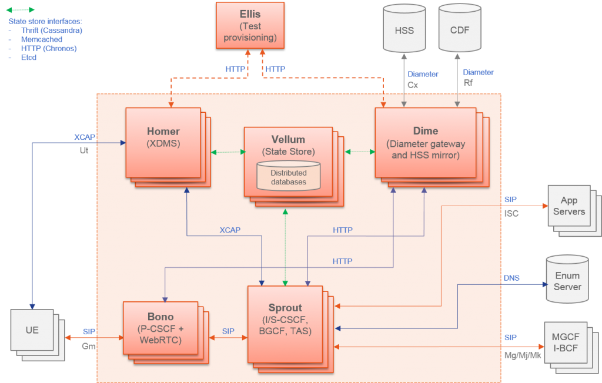

Clearwater implementation for OPNFV
===================================

CONTAINER4NFV setup a Kubernetes cluster on VMs running with Vagrant and kubeadm.

kubeadm assumes you have a set of machines (virtual or bare metal) that are up and running. In this way we can get a cluster with one master node and 2 workers (default). If you want to increase the number of workers nodes, please check the Vagrantfile inside the project.

Is Clearwater suitable for Network Functions Virtualization?

Network Functions Virtualization or NFV is, without any doubt, the hottest topic in the telco network space right now.  It’s an approach to building telco networks that moves away from proprietary boxes wherever possible to use software components running on industry-standard virtualized IT infrastructures.  Over time, many telcos expect to run all their network functions operating at Layer 2 and above in an NFV environment, including IMS.  Since Clearwater was designed from the ground up to run in virtualized environments and take full advantage of the flexibility of the Cloud, it is extremely well suited for NFV.  Almost all of the ongoing trials of Clearwater with major network operators are closely associated with NFV-related initiatives.

About Clearwater
----------------

[Clearwater](http://www.projectclearwater.org/about-clearwater/) follows [IMS](https://en.wikipedia.org/wiki/IP_Multimedia_Subsystem) architectural principles and supports all of the key standardized interfaces expected of an IMS core network.  But unlike traditional implementations of IMS, Clearwater was designed from the ground up for the Cloud.  By incorporating design patterns and open source software components that have been proven in many global Web applications, Clearwater achieves an unprecedented combination of massive scalability and exceptional cost-effectiveness.

Clearwater provides SIP-based call control for voice and video communications and for SIP-based messaging applications.  You can use Clearwater as a standalone solution for mass-market VoIP services, relying on its built-in set of basic calling features and standalone susbscriber database, or you can deploy Clearwater as an IMS core in conjunction with other elements such as Telephony Application Servers and a Home Subscriber Server.

Clearwater was designed from the ground up to be optimized for deployment in virtualized and cloud environments. It leans heavily on established design patterns for building and deploying massively scalable web applications, adapting these design patterns to fit the constraints of SIP and IMS. [The Clearwater architecture](http://www.projectclearwater.org/technical/clearwater-architecture/) therefore has some similarities to the traditional IMS architecture but is not identical.

- All components are horizontally scalable using simple, stateless load-balancing.
- All long lived state is stored on dedicated “Vellum” nodes which make use of cloud-optimized storage technologies such as Cassandra. No long lived state is stored on other production nodes, making it quick and easy to dynamically scale the clusters and minimizing the impact if a node is lost.
- Interfaces between the front-end SIP components and the back-end services use RESTful web services interfaces.
- Interfaces between the various components use connection pooling with statistical recycling of connections to ensure load is spread evenly as nodes are added and removed from each layer.

Clearwater Architecture
-----------------------

